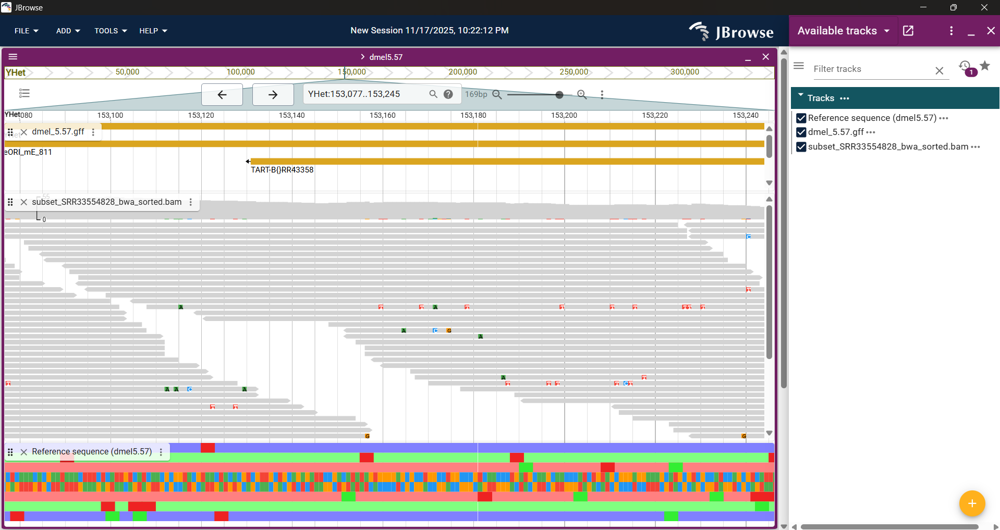

{ width="750", align=center }

# **🧬 TP 2**. Del control de calidad a la detección de variantes genómicas { markdown data-toc-label = 'TP 02' }

[<span style="display:inline-flex;align-items:center;gap:0.4em">:material-download: Materiales</span>](https://drive.google.com/drive/folders/1rfv1DqA5ASeo22wHrG9wJqN4qs7Clu9r?usp=sharing){ .md-button }
[<span style="display:inline-flex;align-items:center;gap:0.4em">:material-file-powerpoint: Slides</span>](https://docs.google.com/presentation/d/1Vb3GfjxVjIiaMuHPtCnXc1vxpQ3hG7AaOPPnJNm9Ew0/edit?usp=sharing){ .md-button }

## Video de la clase
[<span style="display:inline-flex;align-items:center;gap:0.4em">:octicons-video-16: Video</span>](https://us02web.zoom.us/rec/share/QtgFvcbks0FHqBAXVsRbuUX3M4lS6iISadeCLEyqQ9Rbg3Imx0oflvEBOqoqVaeh.xSLcr7kPZ6I_XrOj?startTime=1763640707000){ .md-button }


Código de acceso: 7.=hL&96

## 🎯Objetivos

* **Obtener lecturas** de secuenciación de nueva generación (NGS) disponibles en bases de datos públicas
* **Interpretar los formatos** utilizados comúnmente en NGS
* **Realizar controles** de calidad de las lecturas e interpretar los resultados
* **Mapear** secuencias al genoma de referencia
* **Visualizar** e interpretar alteraciones genéticas

## 📖 Introducción

### 🪰 _Drosophila melanogaster_

_D. melanogaster_ es un **organismo modelo ampliamente utilizado** en genética y biología del desarrollo. Su ciclo de vida corto, facilidad de cultivo en laboratorio y su genoma relativamente pequeño (aproximadamente 175 millones de pares de bases) lo convierten en un **sistema ideal para estudiar procesos biológicos fundamentales**.

El **genoma** de _D. melanogaster_ consiste en **cuatro cromosomas principales** (X, 2, 3 y 4) y un cromosoma sexual (Y). Fue uno de los primeros genomas de eucariotas en ser secuenciado completamente, habiendo sido publicado en el año 2000. Desde entonces, ha sido objeto de numerosos estudios genómicos que han proporcionado información valiosa sobre la genética, la evolución y la biología del desarrollo.

En este trabajo práctico, **vamos a mapear lecturas de secuenciación de _D. melanogaster_ a su genoma de referencia en busca de variantes genéticas**. Estas lecturas están disponibles en bases de datos públicas, y forman parte de un estudio titulado **"_Drosophila melanogaster_ strain: Canton S Genome sequencing"**. Pueden ver información sobre como se generaron estas lecturas en el diseño del experimento publicado en [**NCBI**](https://www.ncbi.nlm.nih.gov/sra/SRX28785043[accn]). 

### Flujo de trabajo de secuenciación y mapeo 

{ width="750", align=center }

La plataforma de secuenciación que se utilizó para esta secuenciación es **DNBSEQ-T7**, una plataforma de secuenciación por síntesis que genera lecturas cortas de alta calidad. Un pipeline típico de análisis de datos de secuenciación incluye los siguientes pasos:

**1. Obtención del ADN y preparación de la biblioteca:** Estos pasos son de _wet lab_, y consisten en la extracción del ADN genómico de las muestras biológicas, seguido de la fragmentación del ADN y la adición de adaptadores específicos para la plataforma de secuenciación.

**2. Amplificación:** El ADN fragmentado se amplifica mediante PCR para aumentar la cantidad de material disponible para la secuenciación.

**3. Secuenciación:** La biblioteca amplificada se carga en la plataforma de secuenciación, donde se generan las lecturas de secuenciación. Se obtienen archivos en formato **FASTQ** que contienen las secuencias de las lecturas junto con sus calidades.

**4. Alineamiento y análisis de datos:** Las lecturas generadas se alinean al genoma de referencia utilizando herramientas bioinformáticas. Posteriormente, se realizan análisis para identificar variantes genéticas, evaluar la calidad de las lecturas y otras características relevantes.

## 🗂️ Bases de datos genómicas

Existen numerosas bases de datos que albergan información genómica y genética de _D. melanogaster_. Algunas de las más relevantes son:

* **[FlyBase](https://flybase.org/)**: Es la base de datos principal para la genética y biología de _D. melanogaster_. Proporciona información sobre genes, mutaciones, fenotipos, secuencias genómicas y mucho más.

* **[Ensembl Metazoa](https://metazoa.ensembl.org/Drosophila_melanogaster/Info/Index)**: Ofrece acceso a datos genómicos de múltiples especies, incluyendo _D. melanogaster_. Permite la visualización y análisis de secuencias genómicas, anotaciones de genes y variantes. 

* **[NCBI](https://www.ncbi.nlm.nih.gov/)**: La base de datos del National Center for Biotechnology Information (NCBI) también alberga secuencias genómicas y datos relacionados con _D. melanogaster_. 


### ● Ejercicio 1: Exploración de bases de datos 

Dentro de la carpeta **Materiales** van a encontrar los archivos necesarios para realizar el práctico. El genoma de referencia y sus anotaciones fueron obtenidas de **FlyBase**. Explorando la web de Flybase (pestaña **Downloads**), respondan:

!!! question " "
  
    === "Preguntas"
    
        1. ¿Cuál es la versión del genoma de referencia de _D. melanogaster_ que vamos a utilizar? ¿Cuándo fue actualizada por última vez?

        2. ¿Qué diferencias hay entre los distintos archivos .fasta? ¿Cuál vamos a utilizar en el TP y por qué?

        3. ¿Qué información contiene el archivo .gff? ¿Para qué lo vamos a utilizar en el TP? ¿Cuántos tipos de .gff hay disponibles para esta versión?
        
    === "Respuesta 1"

        Para responder esta pregunta tienen que entrar al link que tienen en la pista. En ese link van a encontrar todos los archivos de **dmel** disponibles en FlyBase y en simultáneo mirar los archivos que descargaron en la carpeta Materiales. 

        La versión del genoma de referencia la van a encontrar en el nombre del archivo .fasta que está en la carpeta Materiales, y la fecha de actualización la pueden ver en el link de FlyBase.

    === "Respuesta 2"

        Los distintos archivos .fasta contienen diferentes representaciones del genoma de _D. melanogaster_. Algunos archivos pueden contener solo las secuencias de los cromosomas principales, mientras que otros pueden incluir secuencias adicionales como mitocondriales o plásmidos. La información sobre los distintos archivos .fasta y sus contenidos específicos se puede encontrar en la [wiki de Flybase](https://wiki.flybase.org/wiki/FlyBase:Downloads_Overview).

    === "Respuesta 3"

        El archivo .gff (General Feature Format) contiene anotaciones genómicas, que incluyen información sobre la ubicación y características de genes, exones, intrones, regiones reguladoras y otros elementos genómicos. Hay disponibles gffs para cada brazo, discriminados en heterocromatina o no, y sino hay uno que incluye todo el genoma.
        
        En este TP, vamos a utilizar el archivo .gff para identificar las posiciones de los genes y otras características genómicas en el genoma de referencia durante el análisis de las lecturas alineadas.


!!! tip "Pista"
    La página de Flybase puede ser un poco dificil de explorar al principio. Para ver todas las versiones disponibles de los distintos genomas de _D. melanogaster_, hagan click [acá](https://flybase.org/genomes/).

!!! note "Info extra"  
    En los materiales tienen dos archivos .gff3 disponibles, uno llamado all-no-analysis (descargado de FlyBase) y otro llamado dmel_5.57 (procesado para poder trabajar). Si quieren saber cual es la diferencia entre ambos, prueben inspeccionando el inicio y el final de cada archivo con los siguientes comandos:

    ```bash
    # Recuerden estar en la carpeta donde están los archivos .gff3

    head -n 5 dmel-all-no-analysis-r5.57.gff
    head -n 5 dmel_5.57.gff

    tail -n 5 dmel-all-no-analysis-r5.57.gff
    tail -n 5 dmel_5.57.gff
    ```


### ● Ejercicio 2: Inspección de archivos FASTQ

En la carpeta **Materiales** van a encontrar dos archivos FASTQ que comienzan con _subset_ y terminan con _.fastq_. Estos archivos contienen **una selección** de las lecturas de secuenciación que vamos a analizar. Si quisieran obtener las lecturas completas, pueden descargarlas desde el [SRA](https://trace.ncbi.nlm.nih.gov/Traces/?view=run_browser&acc=SRR33554827&display=download). 

!!! question " "

    === "Preguntas"

        1. ¿Qué significan los sufijos _1_ y _2_ de los archivos .fastq?
          
        2. ¿Cuántas líneas tiene cada lectura en un archivo FASTQ? ¿Y cuántas lecturas hay en cada archivo?
          ```bash
            # Recuerden estar en la carpeta donde están los archivos .fastq

            # El * representa comodín, en este caso es cualquier nombre que termine en 1.fastq

            head *1.fastq

            wc -l *1.fastq
          ```

        3. La imagen de abajo les muestra información que se encuentra en las lecturas Illumina, otra forma de secuenciación por síntesis. Usando eso como referencia, comparen las primeras dos lecturas de ambos archivos. ¿Qué diferencias y similitudes encuentran?

        { width="600", align=center }

    === "Respuesta 1"

        Las lecturas con las que estamos trabajando son de tipo _paired-end_. Esto quiere decir que para un mismo fragmento de ADN tenemos una lectura obtenida desde un extremo del fragmento y otra lectura obtenida desde el extremo opuesto. Esto permite obtener información adicional sobre la estructura del ADN y mejorar la precisión del alineamiento.

    === "Respuesta 2"

        Al explorar con head, pueden ver que el patrón de líneas del archivo FASTQ presenta:
        
        1. Una línea que comienza con un símbolo '@' seguida de un identificador único para la lectura.
        2. Una segunda línea contiene la secuencia de nucleótidos (A, T, C, G) de la lectura.
        3. La tercera línea que presenta un símbolo '+'.
        4. La cuarta línea contiene los puntajes de calidad para cada base en la secuencia, codificados en formato ASCII.

        Luego de la línea con caracteres de calidad, volvemos a encontrar el símbolo @ en la siguiente línea.

    === "Respuesta 3"

        En el tipo de secuenciación paired-end, se obtienen dos lecturas (con distinta secuencia de ADN) para cada fragmento (mismo identificador).

## 📈 Métricas de calidad

La calidad de las lecturas de secuenciación es un aspecto crucial en los análisis genómicos. Las métricas de calidad nos permiten evaluar la confiabilidad de las secuencias obtenidas y tomar decisiones informadas sobre su uso en análisis posteriores. Un programa muy usado para evaluar la calidad de las lecturas es **FastQC**. Este software genera un informe detallado que incluye varias métricas clave, tales como:

* **Per base sequence quality**: Este histograma muestra la **distribución de las calidades de las bases a lo largo de las lecturas**. La calidad se mide en una escala logarítmica llamada puntaje Phred, donde valores más altos indican mayor confianza en la base llamada. Idealmente, queremos que la mayoría de las bases tengan un puntaje Phred alto (por ejemplo, >30).

* **Per sequence quality scores**: Este gráfico muestra la **distribución de las calidades promedio de las lecturas**. Nos permite identificar si hay un subconjunto de lecturas con baja calidad que podría afectar los análisis posteriores.

* **Per base sequence content**: Este gráfico muestra la **proporción de cada base (A, T, C, G) en cada posición** a lo largo de las lecturas. En una secuencia aleatoria, esperaríamos ver una distribución aproximadamente uniforme de las bases. Desviaciones significativas pueden indicar sesgos en la secuenciación o problemas técnicos.

* **Adapter Content**: Este gráfico muestra la **presencia de secuencias de adaptadores** en las lecturas. La presencia de adaptadores puede interferir con el mapeo y otros análisis, por lo que es importante identificarlos y eliminarlos si es necesario.

### ● Ejercicio 3: Control de calidad de las lecturas

Para evaluar la calidad de las lecturas que tenemos en la carpeta *Materiales*, vamos a utilizar **FastQC**. 

!!! info "Manuales"

    Para saber que tienen que ejecutar, siempre es útil recurrir al manual del programa. Pueden encontrar esta info si corren en la consola:

    ```bash
      fastqc --help
      
    ```

Corran en la terminal el siguiente comando:

```bash

  # Recuerden estar en la carpeta donde están los archivos .fastq

  # -o indica la carpeta donde se van a guardar los resultados, si no existe, creenla utilizando mkdir
  # El * es un comodín que indica que se van a analizar todos los archivos que terminen en .fastq

  fastqc -o ../Outputs/resultados_fastqc *fastq

```

!!! info "Errores comunes"

    Si ven que el comando no funciona, es probable que el error que estén viendo sea porque no existe el directorio de salida. Pueden crearlo con el comando `mkdir` o desde la carpeta utilizando la interfaz gráfica.


!!! question " "

    === "Preguntas"

        1. ¿Cuántos archivos fastqc se generaron en la carpeta de resultados? ¿Qué tipo de archivos son?

        2. Viendo los reportes de calidad, ¿Qué opinan de los datos? ¿Los usarían para análisis posteriores?. Pueden comparar con este ejemplo de [Reporte de FastQC](https://www.bioinformatics.babraham.ac.uk/projects/fastqc/bad_sequence_fastqc.html). ¿Hay alguna métrica que no hayamos visto en el reporte de nuestras lecturas?

    === "Respuesta 1"

        En la carpeta de resultados deberían ver dos archivos .html y dos archivos .zip, uno para cada archivo .fastq que analizamos. El archivo .html contiene el informe visual de FastQC, mientras que el archivo .zip contiene los datos en bruto utilizados para generar el informe. Para responder la pregunta dos, abran los archivos .html.  

    === "Respuesta 2"

        Los datos son confiables porque tienen una buena calidad en la mayoría de las métricas evaluadas por FastQC. Solo tenemos un _warning_ en la métrica de "Per base sequence content", que puede ser común en lecturas cortas y no necesariamente indica un problema grave. En el reporte que vemos, comparado con el ejemplo de FastQC, no existe la métrica _per tile sequence quality_, porque esta métrica es específica de la plataforma Illumina y no aplica para las lecturas obtenidas con DNBSEQ-T7.


!!! info "Agregando reportes con MultiQC"

    Si bien nosotros estamos trabajando con solo dos archivos de lecturas, es usual que cuando trabajamos con ómicas tengamos muchos mas para analizar. Por lo tanto, para facilitar la interpretación de los resultados de FastQC cuando se tienen múltiples archivos, es común utilizar una herramienta llamada **MultiQC**. Esta herramienta agrega los resultados de múltiples análisis de calidad en un solo informe consolidado.

Para obtener el informe de MultiQC corran en la terminal:

```bash
  # multiqc necesita que le indiquemos la carpeta donde estan los reportes de fastqc y la carpeta donde va a guardar el reporte final

  multiqc ../Outputs/resultados_fastqc/ -o ../Outputs/resultados_multiqc

  # ../ Significa moverse una carpeta hacia arriba, en este caso desde TP2/Materiales a TP2/Outputs

```

## 🧬 Alineamiento de lecturas al genoma de referencia

Ahora que tenemos nuestras lecturas de secuenciación y hemos evaluado su calidad, el siguiente paso es alinearlas al genoma de referencia de _D. melanogaster_. 

Durante el alineamiento, lo que hacemos es encontrar la posición en el genoma donde cada lectura se corresponde mejor, teniendo en cuenta posibles errores de secuenciación y variaciones genéticas.

Existen varias herramientas para realizar el alineamiento de lecturas, entre las más populares se encuentran **BWA** y **Bowtie2**. La elección del alineador depende del tipo y largo de las lecturas, del hardware con el que contemos y del balance entre velocidad/exactitud que sea útil para nuestro análisis.En este práctico, vamos a utilizar **BWA-MEM** (un algoritmo de alineamiento de BWA) debido a su eficiencia y precisión en el alineamiento de lecturas cortas.

### ● Ejercicio 4: Indexado del genoma de referencia

Antes de alinear las lecturas, **necesitamos preparar el genoma de referencia** para que pueda ser utilizado por el alineador. Este proceso se llama **indexado** y crea una estructura de datos que permite búsquedas rápidas durante el alineamiento. 

Para indexar el genoma de referencia, corran en la terminal:

```bash

  # Recuerden estar en la carpeta donde está el archivo .fasta del genoma de referencia

  bwa index dmel-all-chromosome-r5.57.fasta
```
!!! question " "

    === "Preguntas"
        1. ¿Cuántos archivos nuevos tienen ahora en la carpeta Materiales?  

    === "Respuesta 1"
        Deberían ver cinco archivos nuevos con las siguientes extensiones: .amb, .ann, .bwt, .pac, .sa.

Los archivos generados son índices que permiten a BWA realizar búsquedas rápidas en el genoma de referencia durante el proceso de alineamiento. Cada archivo tiene un propósito específico:

| Extensión | Descripción |
|---|---|
| **.amb** | Contiene información sobre las posiciones ambiguas en el genoma. |
| **.ann** | Contiene anotaciones del genoma, como la longitud de cada cromosoma. |
| **.bwt** | Es el índice Burrows-Wheeler Transform, que permite búsquedas rápidas de patrones en el genoma. |
| **.pac** | Contiene la secuencia del genoma en un formato comprimido. |
| **.sa** | Es el índice de sufijos, que también facilita la búsqueda de patrones en el genoma. |

### ● Ejercicio 5: Alineamiento de las lecturas

Ahora que tenemos el genoma de referencia indexado, podemos proceder a alinear nuestras lecturas de secuenciación. Utilizaremos el comando `bwa mem` para este propósito. Corran en la terminal:

```bash
  # Recuerden estar en la carpeta donde están los archivos .fastq y el archivo .fasta del genoma de referencia

  # Tengan paciencia, tarda unos 10 minutos en correr

  bwa mem dmel-all-chromosome-r5.57.fasta *1.fastq *2.fastq > ../Outputs/subset_SRR33554828_bwa.sam
```

!!! question " "

    === "Preguntas"

        1. ¿Qué tipo de archivo se generó en la carpeta Outputs? ¿Qué información contiene este archivo? Pueden inspeccionarlo con `head` y `tail`.

    === "Respuesta 1"

        El archivo generado es un archivo **SAM** (Sequence Alignment/Map). Este archivo es un estándar para almacenar alineamientos de secuencias, y contiene información detallada sobre cómo cada lectura de secuenciación se alinea al genoma de referencia. 

        Al inspeccionar el archivo con `head` y `tail`, pueden ver que el archivo SAM tiene dos secciones principales:

        1. **Encabezado**: Las primeras líneas del archivo comienzan con el símbolo '@' y contienen metadatos sobre el alineamiento, como la versión del formato SAM, la referencia del genoma utilizado, y estadísticas generales del alineamiento.

        2. **Cuerpo**: Después del encabezado, cada línea representa una lectura alineada y contiene varios campos separados por tabulaciones. Estos campos incluyen el identificador de la lectura, la posición en el genoma donde se alinea, la secuencia de la lectura, los puntajes de calidad, y otros detalles relevantes sobre el alineamiento.


!!! info "De SAM a BAM"
    El archivo **SAM** (Sequence Alignment/Map) puede ser bastante grande y no es eficiente para su almacenamiento y procesamiento. Por lo tanto, es común convertirlo a un formato binario más compacto llamado **BAM** (Binary Alignment/Map). Además, los archivos BAM suelen ordenarse por la posición en el genoma para facilitar el acceso y análisis de las lecturas alineadas.

Vamos a realizar la conversión y ordenamiento del archivo SAM a BAM utilizando la herramienta **samtools**. Corran en la terminal:

```bash
  # Recuerden estar en la carpeta Outputs donde está el archivo .sam

  samtools view -Sb subset_SRR33554828_bwa.sam | samtools sort -o subset_SRR33554828_bwa_sorted.bam

```
!!! question " "

    === "Preguntas"
        
        1. ¿Qué diferencias hay entre los archivos .sam y .bam (prueben explorar con `head` el archivo .bam)? 
    
        2. ¿Cuál es el factor de compresión?

    === "Respuesta 1"

        El archivo .bam es un archivo binario, por lo que no se puede leer directamente con `head` como un archivo de texto. Si intentan hacerlo, verán caracteres incomprensibles. En cambio, el archivo .sam es un archivo de texto legible que contiene información detallada sobre cada alineamiento.

    === "Respuesta 2"

        Pueden comparar el tamaño de ambos archivos utilizando el comando `ls -lh` en la terminal para ver cuánto espacio ocupa cada uno. El factor de compresión es la división del tamaño del archivo .sam por el tamaño del archivo .bam.

Por último, asi como indexamos el genoma de referencia para el alineamiento, también es recomendable indexar el archivo BAM ordenado. Esto va a hacer que los _genome browsers_  puedan acceder rápidamente a las lecturas alineadas en posiciones específicas del genoma. 

Corran en la terminal:

```bash
  # Recuerden estar en la carpeta Outputs donde está el archivo .bam

  samtools index subset_SRR33554828_bwa_sorted.bam

```

!!! info "índice BAM (.bai)"

    Al indexar el archivo BAM, se genera un archivo adicional con la extensión `.bai`. Este archivo, como su nombre lo indica, actúa como el índice de un libro. Si el browser quiere ver, por ejemplo, el cromosoma 2L, no tiene que leer todo el archivo BAM. Lo que hace es consultar el archivo .bai para saber en qué parte del archivo BAM se encuentran las lecturas correspondientes a ese cromosoma, y así puede acceder directamente a esa sección, ahorrando tiempo y recursos.

## 🖥️ Visualización interactiva con JBrowse2

Un _genome browser_ es una herramienta que permite visualizar y explorar datos genómicos de manera interactiva. Estos navegadores proporcionan una interfaz gráfica donde los usuarios pueden ver secuencias de ADN, anotaciones genómicas, lecturas alineadas y otros tipos de datos relacionados con el genoma.

En este TP vamos a utilizar **JBrowse2**, un navegador genómico moderno y altamente personalizable. Este browser se maneja cargando _tracks_ (capas) de datos genómicos que pueden incluir secuencias de referencia, anotaciones de genes, lecturas alineadas y variantes genéticas.

Para este punto ya deberían tener el programa instalado en su computadora. Si no es así, pueden seguir las instrucciones de instalación que se encuentra en la sección de [instructivos](../../instructivos/jbrowse2/index.md).

### ● Ejercicio 6: Cargando datos en JBrowse2

1. Abran JBrowse2 y creen un nuevo proyecto clickeando en **OPEN NEW GENOME**. Esto va a abrir una ventana donde van a poder cargar el genoma de referencia. 

    | Celda | Contenido | Descripción |
    |---|---|---|
    | Assembly name | Drosophila melanogaster (r5.57) | Nombre del genoma de referencia |
    | Type | FastaAdapter | Tipo de _track_ |
    | Fasta file | dmel-all-chromosome-r5.57.fasta | Ruta local al archivo .fasta del genoma de referencia |

2. Ahora van a ver dos botones, uno que dice **OPEN** y otro que dice **SHOW ALL REGIONS IN ASSEMBLY**. Seleccionen el cromosoma **YHet** y hagan click en **OPEN**.

3. El siguiente paso es agregar las anotaciones genómicas. Hagan click en el ícono de **+** que está en la barra lateral izquierda y seleccionen **Add track**. Si no lo encuentran, clickeen **OPEN TRACK SELECTOR** y ahí van a ver el botón de **+**.

    | Celda | Contenido | Descripción |
    |---|---|---|
    | Main file | dmel_5.57.gff | archivo gff _parseado_ |
    | Index file | - No completar - | Archivo de índice del gff (no es necesario) |
    
    Luego hagan click en **NEXT** para terminar de configurar el track.

    Dejen las opciones por defecto y hagan click en **ADD**.

    Una vez que cargue (puede tardar unos segundos), deberían ver las anotaciones genómicas sobre el genoma de referencia. Si les aparece un _warning_ en amarillo, hagan zoom en alguna región para que desaparezca.

4. Finalmente, vamos a cargar las lecturas alineadas. Hagan click nuevamente en el ícono de **+** y seleccionen **Add track**.

    | Celda | Contenido | Descripción |
    |---|---|---|
    | File | subset_SRR33554828_bwa_sorted.bam | Archivo .bam con las lecturas alineadas |
    | Index file | subset_SRR33554828_bwa_sorted.bam.bai | Archivo .bai con el índice del archivo .bam |

    Presionen **NEXT** para continuar, y luego hagan click en **ADD** para finalizar.

    Ahora deberían ver las lecturas alineadas sobre el genoma de referencia y las anotaciones genómicas.

### ● Ejercicio 7: Explorando los datos en JBrowse2

Si todo salió bien, ya deberían tener cargados en JBrowse2 el genoma de referencia, las anotaciones genómicas y las lecturas alineadas. Ahora es momento de explorar los datos. Su navegador debería verse similar a la imagen de abajo:

{ width="900", align=center }

!!!question " "

    === "Preguntas"

        1. ¿Qué pueden decir sobre la cobertura de las lecturas alineadas? ¿Hay regiones del genoma con mayor o menor cobertura?

        2.  En términos de similitud con el genoma de referencia, ¿las lecturas parecen alinearse bien? ¿Hay muchas discrepancias visibles?

        3. ¿Pueden identificar alguna región genómica específica donde haya anotaciones pero no lecturas alineadas? ¿Qué podría indicar esto?

    === "Respuesta 1"

        La cobertura de las lecturas alineadas puede variar a lo largo del genoma. Algunas regiones pueden tener una alta densidad de lecturas, lo que indica una buena cobertura, mientras que otras regiones pueden tener pocas o ninguna lectura alineada, lo que sugiere una baja cobertura. Estas variaciones pueden deberse a factores como la eficiencia de la secuenciación, la complejidad del genoma o la presencia de regiones repetitivas. 

        Por ejemplo, **gypsy_6** (pueden encontrar la anotación ubicandose en YHet:109,557..124,226) es una región con alta cobertura de lecturas alineadas, lo cual tiene sentido cuando vemos en la descripción de la anotación que es una _repeat region_.

    === "Respuesta 2"

        En general, las lecturas parecen alinearse bien con el genoma de referencia, ya que la mayoría de las lecturas están ubicadas en posiciones coherentes con las anotaciones genómicas. Las discrepancias parecen ser variaciones puntuales, vistas como colores en las lecturas alineadas. En este punto no podemos decir con certeza si son errores puntuales o si es una variación genética real.

    === "Respuesta 3"

        Sí, es posible identificar regiones genómicas donde hay anotaciones pero no lecturas alineadas. Esto podría indicar varias cosas, como regiones del genoma que no fueron bien cubiertas durante la secuenciación, regiones altamente repetitivas que dificultan el alineamiento, o incluso posibles errores en las anotaciones genómicas. Estas áreas pueden ser de interés para estudios adicionales, ya que podrían revelar información sobre la estructura y función del genoma.

        Las lecturas cortas no son la mejor forma de resolver regiones repetitivas, por lo que es dificil concluir algo en estas zonas sin datos adicionales. En estos casos, es mejor utilizar tecnologías de secuenciación de lecturas largas que pueden atravesar estas regiones y proporcionar una mejor resolución. 

No cierren JBrowse2, ya que lo vamos a necesitar para el siguiente ejercicio.

### ● Ejercicio 8: Identificación de variantes genéticas

Ahora que hemos explorado las lecturas alineadas, el siguiente paso es identificar posibles variantes genéticas en comparación con el genoma de referencia. Si bien ya vimos, por la presencia de bases coloreadas, esta observación no es suficiente para concluir que hay variantes genéticas reales. El **llamado de variantes** (variant calling) es un proceso que analiza todos los alineamientos y decide estadísticamente si existe una variante en una posición específica del genoma.

Vamos a utilizar **bcftools** para realizar el llamado de variantes con nuestros archivos BAM. Corran en la terminal:

=== "Obtención de variantes"

    === "Código"

        ```bash
          # Recuerden estar en la carpeta Outputs donde está el archivo .bam

          # Primero, generamos un archivo VCF con las variantes detectadas

          bcftools mpileup -f ../Materiales/dmel-all-chromosome-r5.57.fasta subset_SRR33554828_bwa_sorted.bam | bcftools call -mv -Ov -o subset_SRR33554828_variants.vcf

        ```

    === "Código con comentarios"

        ```bash
          # Recuerden estar en la carpeta Outputs donde está el archivo .bam

          # El comando antes del pipe (|) genera un _pileup_ de las lecturas alineadas utilizando el genoma de referencia. Este comando genera un archivo BCF, que nosotros no vamos a ver porque se va a utilizar como input para el siguiente comando.

          # -f indica el archivo fasta del genoma de referencia

          # El comando después del pipe (|) realiza el llamado de variantes utilizando el _pileup_ generado previamente.

          # -mv indica que queremos hacer llamado de variantes (m) y mostrar solo las variantes (v)
          # -Ov indica que queremos el output en formato VCF (texto)
          # -o indica el nombre del archivo de salida

          bcftools mpileup -f ../Materiales/dmel-all-chromosome-r5.57.fasta subset_SRR33554828_bwa_sorted.bam | bcftools call -mv -Ov -o subset_SRR33554828_variants.vcf

        ```

Ahora que tenemos el archivo VCF con las variantes detectadas, podemos cargarlo en JBrowse2 para visualizarlas junto con las lecturas alineadas y las anotaciones genómicas. Vuelvan a JBrowse2 y hagan click en el ícono de **+** para agregar un nuevo track.

| Celda | Contenido | Descripción |
|---|---|---|
| File | subset_SRR33554828_variants.vcf | Archivo .vcf con las variantes detectadas |
| Index file | - No completar - | Archivo de índice del VCF (se genera automáticamente al cargar el VCF) |

Para ver mejor las variantes, vamos a desactivar momentáneamente las anotaciones. En el panel **Available Tracks**, destilden la casilla correspondiente al gff.

!!! question " "

    === "Preguntas"

        1. ¿Cuántas variantes se detectaron en total? Pueden contar las líneas del archivo VCF que no comienzan con # utilizando el comando `grep -v '^#' | wc -l`?

        2. Busquen alguna variante en particular y explíquenla. ¿Qué tipo de variante es? ¿En qué posición del genoma se encuentra? ¿Afecta a algún gen anotado?

        3. ¿Cómo podrían validar si estas variantes son reales y no errores de secuenciación o alineamiento?

    === "Respuesta 1"

        Pueden contar las líneas del archivo VCF que no comienzan con # utilizando el siguiente comando en la terminal:

        ```bash
          # Recuerden estar en la carpeta Outputs donde está el archivo .vcf

          grep -v '^#' subset_SRR33554828_variants.vcf | wc -l
        ```

        Este comando filtra las líneas que no comienzan con '#' (que son los encabezados y comentarios) y luego cuenta el número de líneas restantes, que corresponden a las variantes detectadas.

    === "Respuesta 2"

        Hay muchos ejemplos de distintas variantes en el archivo VCF. Variantes de interés podrían ser aquellas que se encuentran en regiones codificantes de genes o en regiones reguladoras importantes. Por ejemplo, inserciones o deleciones que alteren el marco de lectura de un gen, o SNPs que cambien aminoácidos críticos en proteínas.

    === "Respuesta 3"

        Para validar si las variantes son reales, se podrían utilizar varias estrategias:

        * **Re-secuenciación**: Realizar una nueva secuenciación de la misma muestra para ver si las variantes se reproducen.

        * **Métodos alternativos**: Utilizar técnicas como PCR seguida de secuenciación Sanger para confirmar la presencia de variantes específicas.

        * **Validación funcional**: Si la variante afecta a un gen conocido, realizar experimentos funcionales para evaluar el impacto de la variante en la función del gen o la proteína.

        Tengamos en cuenta que las variantes detectadas en este TP son solo un subconjunto de las posibles variantes presentes en la muestra, ya que trabajamos con un subconjunto de lecturas. Para un análisis más completo, sería ideal trabajar con el conjunto completo de datos de secuenciación. También es importante considerar distintos genomas de referencia, para contemplar variaciones de poblaciones o cepas.


## 🧠 Resumen

¡Llegamos al final de la guía! En este TP realizamos un _pipeline_ de análisis de datos de secuenciación:

1. Empezamos con datos crudos (.fastq) obtenidos de bases de datos públicas.

2. Evaluamos la calidad de las lecturas utilizando FastQC y MultiQC.

3. Alineamos las lecturas al genoma de referencia utilizando BWA para crear un archivo .SAM.

4. Convertimos el archivo .SAM a .BAM ordenado e indexado utilizando samtools.

5. Visualizamos los datos en JBrowse2, explorando las lecturas alineadas y las anotaciones genómicas.

6. Realizamos el llamado de variantes utilizando bcftools y visualizamos las variantes detectadas en JBrowse2.

Y recuerden, que **el punto mas importante de todo este proceso es la interpretación biológica de los resultados obtenidos**, y ahí es donde ustedes pueden aportar su conocimiento y creatividad para generar nuevas hipótesis y descubrimientos.

## 🧩 Ejercicio adicional: Evaluación de ensamblajes usando QUAST

Para esta parte adicional del práctico, vamos a utilizar el genoma publicado por el mismo grupo del cual obtuvimos las lecturas de Illumina. Pueden descargar el ensamblaje explorando [este enlace](https://www.ncbi.nlm.nih.gov/nuccore/JBMFZO000000000.1). Vayan hasta el final de la página y clickeen el enlace que dice **WGS**. Van a acceder al [Sequence Set Browser](https://www.ncbi.nlm.nih.gov/Traces/wgs/JBMFZO01?display=download) del genoma, y desde ahí, en la pestaña Download, descargen el archivo **FASTA**. Este archivo está comprimido, por lo tanto **no se olviden de descomprimirlo a la hora de utilizarlo**.

Como vimos en la teórica, a partir de las lecturas se puede realizar un ensamblaje del genoma. Una vez que tenemos el ensamblaje, es importante evaluar su calidad utilizando herramientas como **QUAST** (Quality Assessment Tool for Genome Assemblies). QUAST calcula métricas clave como el N50, el largo total y la cantidad de contigs que hay en un ensamblaje. Dado que lo vamos a comparar con un genoma de referencia, también podemos calcular la precisión del ensamblaje respecto a la referencia.

!!! info "Requisitos"

    Para esta parte del TP vamos a necesitar instalar QUAST, lo cual podemos hacer dentro del ambiente conda del tp2. Para instalarlo, corran en la terminal:

    ```bash
        conda install -c bioconda quast
    ```

Una vez instalado QUAST, vamos a realizar la comparación. Corran en la terminal:

=== "Codigo"

    ``` bash

        quast.py -r Materiales/dmel-all-chromosome-r5.57.fasta -o Outputs/resultados_quast JBMFZO01.1.fsa_nt/JBMFZO01.1.fsa_nt
    ```

=== "Codigo con comentarios"

    ``` bash

        # El ejemplo tiene como directorio de trabajo la carpeta del TP

        quast.py -r Materiales/dmel-all-chromosome-r5.57.fasta -o Outputs/resultados_quast JBMFZO01.1.fsa_nt/JBMFZO01.1.fsa_nt

        # -r es el genoma de referencia, que se encuentra dentro de la carpeta Materiales

        # -o dice donde quiero guardar los resultados, en una carpeta dentro Outputs llamada "resultados_quast"

        # El último parámetro es el genoma de referencia
    ```

Este código tarda un par de minutos en completarse. Cuando finalice, vayan a la carpeta de resultados y abran el archivo `report.html`. Van a encontrar una tabla con métricas y varios gráficos interactivos.

!!! question " "

    === "Preguntas"

        1. Observen las métricas **# contigs** y **L50**. Sabiendo que *Drosophila melanogaster* tiene 4 pares de cromosomas (X, 2, 3, 4) y un par sexual (Y), ¿Cómo interpretan que el número total de fragmentos sea tan bajo? ¿Qué representan esos 3 contigs del L50?
        
        2. Busquen el valor de N50 en el reporte. ¿Qué significa este número y por qué es más informativo que el "largo promedio" de los contigs?

        3. Comparen el **Total length** del ensamblaje contra la longitud de la referencia. ¿El ensamblaje es más grande o más chico? ¿A qué creen que se debe esa diferencia de aproximadamente 7 Mb?

        4. Teniendo en cuenta que en los ejercicios anteriores trabajamos con lecturas de **Illumina** (cortas), ¿creen que este ensamblaje se pudo lograr *solo* con las lecturas que analizaron antes? ¿Por qué?

    === "Respuesta 1"

        El ensamblaje es de **calidad cromosómica**. Tener solo 12 contigs indica que cada secuencia corresponde prácticamente a un brazo cromosómico completo o un cromosoma entero.
        
        El **L50 de 3** significa que con solo los 3 fragmentos más grandes ya cubrimos la mitad del genoma. Biológicamente, esto tiene sentido porque *Drosophila* tiene cromosomas muy grandes (el 2, el 3 y el X) que constituyen la mayor parte del ADN. Este valor indica que el ensamblaje logró reconstruir esos grandes cromosomas casi sin cortes. Si no lo encuentran esta métrica, clickeen en **Extended report**


    === "Respuesta 2"
        
        El **N50** es una métrica estadística que indica la continuidad del ensamblaje. Se define como la longitud del contig más corto tal que, si ordenamos todos los contigs de mayor a menor, la suma de las longitudes de los contigs más largos cubre al menos el 50% del tamaño total del ensamblaje.

    === "Respuesta 3"
        
        El ensamblaje es ligeramente **más pequeño** (161.6 Mb vs 168.7 Mb).
    
        Esta diferencia de ~7 Mb suele corresponder a regiones de **heterocromatina constitutiva**, centrómeros o telómeros. Estas zonas están llenas de secuencias altamente repetitivas que son extremadamente difíciles de secuenciar y ensamblar, por lo que a menudo quedan fuera incluso en los mejores ensamblajes, o la referencia incluye regiones "de relleno" (N's) para estimar esos tamaños que este ensamblaje no tiene.

    === "Respuesta 4"
        
        **No, es muy improbable** que este resultado provenga solo de lecturas cortas (Illumina).
    
        Las lecturas cortas no pueden atravesar regiones repetitivas largas, lo que suele resultar en ensamblajes fragmentados con miles de contigs pequeños y un N50 bajo (ej. 50-100 kb). Un N50 de **29 Mb** sugiere fuertemente que se utilizaron tecnologías de **lecturas largas** (como PacBio o Nanopore) o mapas ópticos para cerrar los huecos ("gaps") y lograr esa continuidad. El archivo que analizamos es seguramente un ensamblaje híbrido o curado profesionalmente.

        Si buscan el proyecto en [NCBI](https://www.ncbi.nlm.nih.gov/bioproject/PRJNA1237537), verán que el mismo grupo publicó lecturas de Oxford Nanopore y PacBIO HiFi, con toda esa información generaron el ensamblado.


## 📚 Recursos adicionales

* [FastQC Documentation](https://www.bioinformatics.babraham.ac.uk/projects/fastqc/)
* [BWA Manual](http://bio-bwa.sourceforge.net/bwa.shtml)
* [Samtools Documentation](http://www.htslib.org/doc/samtools.html)
* [JBrowse2 Documentation](https://jbrowse.org/jb2/docs/)
* [Bcftools Documentation](http://www.htslib.org/doc/bcftools.html)