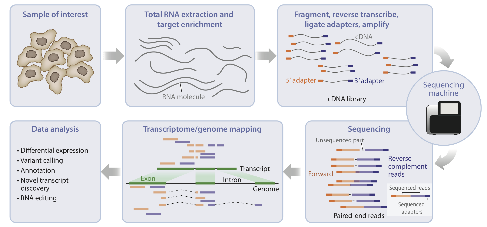

{ width="650", align=center }

# **TP 3**. Transcriptómica { markdown data-toc-label = 'TP 03' }

<!--
[<span style="display:inline-flex;align-items:center;gap:0.4em">:material-download: Materiales</span>](https://drive.google.com/file/d/1b74X8uGOYGTHt_OaJZbn9N385MjwWswV/view?usp=sharing){ .md-button }
[<span style="display:inline-flex;align-items:center;gap:0.4em">:material-file-powerpoint: Slides</span>](https://docs.google.com/presentation/d/1Vb3GfjxVjIiaMuHPtCnXc1vxpQ3hG7AaOPPnJNm9Ew0/edit?usp=sharing){ .md-button }
[<span style="display:inline-flex;align-items:center;gap:0.4em">:material-youtube: Clase grabada</span>](https://drive.google.com/){ .md-button }
-->

En esta clase analizaremos **la calidad de las lecturas crudas y filtradas** de un experimento real de *Drosophila melanogaster*, tomado de un paper reciente que explora diferencias transcriptómicas entre fenotipos de ojo rojo y ojo blanco.

[<span style="display:inline-flex;align-items:center;gap:0.4em">:material-download: Materiales</span>](https://drive.google.com/drive/folders/1ybf6sZrH7E7Gqiksd4OV2Kc1k26JyhZn?usp=drive_link){ .md-button }
[<span style="display:inline-flex;align-items:center;gap:0.4em">:material-file-pdf-box: PDFs Adicionales</span>](https://drive.google.com/drive/folders/1Ylkt89MIPL0uKkUXA7EOuZt6KHBZlM82?usp=drive_link){ .md-button }
---

## 📄 Paper base

**More than meets the eye: mutation of the *white* gene in *Drosophila* has broad phenotypic and transcriptomic effects**  
*April Rickle, Krittika Sudhakar, Alix Booms, Ellen Stirtz, Adelheid Lempradl*  
📘 *Genetics*, Volume 230, Issue 3, July 2025, iyaf097  
🔗 [DOI: 10.1093/genetics/iyaf097](https://doi.org/10.1093/genetics/iyaf097)

!!! abstract
    En este trabajo, las autoras analizan cómo la mutación del gen **white** en *Drosophila melanogaster* no sólo afecta la pigmentación ocular, sino que también genera amplias modificaciones en la expresión génica.  
    En el presente práctico utilizaremos las bases de datos generadas en este estudio para realizar el **control de calidad** previo al análisis transcriptómico.

---

## ⚙️ 0. Preparación del Entorno (¡Importante!)

Antes de comenzar, es fundamental asegurarse de tener todas las herramientas instaladas. La forma más sencilla y recomendada de gestionar estas herramientas bioinformáticas es a través de **Conda** (específicamente, el canal `bioconda`).

=== Herramientas de Línea de Comando (con Conda)
    ```bash
    # 1. (Recomendado) Crear un entorno de conda dedicado para este análisis
    # Esto evita conflictos entre las dependencias de los programas.
    conda create -y -n transcriptomics -c bioconda fastqc trim-galore star multiqc samtools

    # 2. Activar el entorno antes de correr los comandos
    # Deberás hacer esto cada vez que abras una nueva terminal para el práctico.
    conda activate transcriptomics
    ```

=== Paquetes de R (con BiocManager)
    ```r
    # Para la Parte 5, necesitarás varias librerías de R.
    # Puedes instalarlas desde tu consola de R o RStudio.

    # Instala BiocManager si no lo tienes
    if (!requireNamespace("BiocManager", quietly = TRUE))
        install.packages("BiocManager")

    # Instala los paquetes de Bioconductor necesarios
    BiocManager::install(c(
      "DESeq2", 
      "org.Dm.eg.db", 
      "AnnotationDbi", 
      "clusterProfiler",
      "apeglm"
    ))

    # Instala los paquetes de CRAN necesarios
    install.packages(c("ggplot2", "pheatmap", "tibble", "dplyr"))
    ```

## Hands-on!

La primera parte de un pipeline adecuado en transcriptómica, comienza evaluando la **calidad de las lecturas RNA-seq** antes y después del trimeado utilizando, en este caso, las herramientas **FastQC**, **Trim Galore** y **MultiQC**.

---

## 🧬 Datos experimentales

Antes de comenzar el control de calidad, es importante **caracterizar las muestras**:  
¿De qué organismo provienen? ¿Qué tipo de secuenciación se usó? ¿Cuál es la longitud de las lecturas?

En esta parte del práctico, el objetivo es que **ustedes mismos obtengan esta información** a partir de los datos crudos y los metadatos del paper.

### 🕵️‍♀️ 1️⃣ Exploración de los archivos crudos

Cada muestra está disponible como un archivo comprimido `.fastq.gz` dentro del directorio del proyecto. Vamos a explorar estos archivos usando diversas herramientas.

#### 1.1 Exploración básica con comandos Unix y samtools

```bash
# Listar archivos y ver tamaños
ls -lh Drosophila_RNAseq_PRJNA1226617/

# Ver las primeras 4 entradas del FASTQ
zcat Drosophila_RNAseq_PRJNA1226617/SRR32429928_1.fastq.gz | head -4

## OPCIONAL ##
# Contar número total de lecturas (dividir por 4 ya que cada lectura usa 4 líneas)
zcat Drosophila_RNAseq_PRJNA1226617/SRR32429928_1.fastq.gz | wc -l | awk '{print $1/4}'

```

!!! info "Estructura del FASTQ"
    Cada entrada en el archivo FASTQ contiene 4 líneas:
    1. Encabezado con @ (información de la secuenciación)
    2. Secuencia de nucleótidos
    3. Línea separadora con +
    4. Calidades en formato Phred+33


!!! question "Preguntas"
    - ¿Qué información podés obtener del encabezado (@SRR...)?
    - ¿Podés identificar si la lectura es paired-end o single-end?
    - ¿Qué longitud tienen las secuencias?
    - ¿Qué nos dice la distribución de calidades?


??? success "🔹 ¿Qué información podés obtener del encabezado (@SRR...)?"

    - **Identificador del experimento:** SRR32429928 (acceso SRA, indica el conjunto de lecturas del estudio).  
    - **Número de lectura:** .1, .2, .3, etc., identifican cada lectura individual.  
    - **Información del instrumento:** AV234602:FC336:2416495127 hace referencia al identificador del flujo y la celda del secuenciador.  
    - **Coordenadas de la lectura en el flowcell:** 1:10102:0091:0008 indican el número de la celda, la hilera y la columna donde se leyó la secuencia.  
    - **Longitud declarada de la lectura:** length=75.

??? success "🔹 ¿Podés identificar si la lectura es *paired-end* o *single-end*?"

    Es pair-end porque los archivos terminan en _1 y _2 respectivamente.

??? success "🔹 ¿Qué longitud tienen las secuencias?"

    La longitud indicada en el encabezado y confirmada al inspeccionar las secuencias es de **75 nucleótidos** (length=75).  

??? success "🔹 ¿Qué nos dice la distribución de calidades?"

    En la línea de calidad (la que comienza con +), cada carácter representa la **calidad Phred** de un nucleótido.  
    Por ejemplo:
    ```
    GLLLLLLLMMMMNMMNNNNNNNNNNNNNNNNNNNNNNNNNNNNNNNNNNNNNNNNNNNNNNNNNNNNNNNNNNNN
    ```

    - Los caracteres como L, M, N, G corresponden a **valores ASCII** que indican distintas calidades de lectura.  
    - Las letras **más altas en el alfabeto ASCII** representan **mayor calidad**.  
    - Se observa una **disminución progresiva en la calidad** hacia el final de la secuencia (más N), algo común en lecturas Illumina.  
    - Esto sugiere que el **extremo 3’** de las lecturas tiende a tener **menor confianza en la llamada de bases** y puede requerir **trimming** antes del alineamiento.

??? tip "Interpretación general y próximos pasos"

    - Las lecturas son **pair-end** de **75 nucleótidos**.  
    - La calidad es aceptable, pero **disminuye hacia el extremo 3’**.  
    - Se recomienda realizar un control de calidad con **FastQC** y aplicar **trimming**.  
    - Estos pasos aseguran una **mejor alineación** y **menor sesgo** en el análisis transcriptómico.

🧾 2️⃣ Consultar los metadatos del estudio

Otro camino suele ser que los metadatos asociados al experimento pueden obtenerse desde el NCBI SRA o desde el paper original.

Buscá el BioProject en NCBI correspondiente al estudio:

🔗 [PRJNA1226617](https://www.ncbi.nlm.nih.gov/bioproject/PRJNA1226617)

!!! tip
    Podés ver detalles como:
    - Plataforma de secuenciación (Instrument Model)
    - Layout (Paired / Single)
    - Read length (por ejemplo, 75 bp)
    - Tipo de librería (mRNA, Total RNA, etc.)


??? success "💡 Ver respuesta esperada"
    | Característica | Descripción |
    |-----------------|--------------|
    | **Organismo** | *Drosophila melanogaster* |
    | **Plataforma de secuenciación** | Element Biosciences AVITI |
    | **Tipo de lectura** | Paired-end |
    | **Longitud** | 2 × 75 bp |
    | **Kit de preparación** | KAPA mRNA HyperPrep Kit |
    | **Tipo de librería** | mRNA poliA estándar (adaptadores Illumina) |
    | **Número de muestras** | 10 (5 ojo blanco y 5 ojo rojo) |

**Distribución de muestras:**

🪰⚪ *White-eye*: muestras 28 a 32  
🪰🔴 *Red-eye*: muestras 38 a 42  

!!! note "Archivos de entrada"
        Los archivos `.fastq.gz` ya están disponibles en la carpeta compartida del curso.

---

## 🧩 Parte 1: Análisis de calidad inicial

=== 1️⃣ Ejecutar FastQC
    ```bash
     #FastQC permite evaluar la calidad de las lecturas crudas (`.fastq.gz`).
     mkdir -p fastqc_results
     fastqc Drosophila_RNAseq_ PRJNA1226617/SRR32429928_1.fastq.gz -o fastqc_results

    ```

!!! tip
        Cada muestra generará un archivo `.html` con los gráficos de calidad y un archivo `.zip` con los datos resumidos.
        Acá también podrías encontrar información sobre tu secuenciación como tamaño de reads, calidad, etc.

=== 2️⃣ Explorar resultados
    ```bash
    #Abrir uno de los reportes HTML (por ejemplo, en un navegador web local):
    xdg-open fastqc_results/SRR32429928_1_fastqc.html
    ```

Revisar los siguientes módulos principales:
    - *Per base sequence quality* 
    - *Per sequence GC content* 
    - *Adapter content* 
    - *Sequence length distribution* 

!!! question "Preguntas para discutir"
        - ¿Qué patrones de calidad observas hacia el final de las lecturas?  
        - ¿Existen adaptadores detectados?  
        - ¿Hay diferencias notorias entre muestras?

---

## ✂️ Parte 2: Trimeado de lecturas

=== 1️⃣ Ejecutar Trim Galore

Trim Galore combina **Cutadapt** y **FastQC** para recortar adaptadores y bases de baja calidad.
    ```bash

    mkdir -p trimmed_reads

    # Ejecutar Trim Galore solo para la muestra SRR32429928

    trim_galore \
    --paired \                # modo paired-end
    --illumina \              # remueve adaptadores Illumina
    --quality 20 \            # Q20: descarta bases de baja calidad en los extremos
    --fastqc \                # genera reportes FastQC automáticamente
    --length 50 \             # descarta reads más cortos que 50 bp
    --cores 4 \               # usa 4 núcleos (ajustar según la PC)
    --output_dir trimmedgalore_reads \  # guarda resultados en esta carpeta
    Drosophila_RNAseq_PRJNA1226617/SRR32429928_1.fastq.gz \
    Drosophila_RNAseq_PRJNA1226617/SRR32429928_2.fastq.gz

    ```

!!! info
        Trim Galore automáticamente genera nuevos archivos `*_val_1.fq.gz` y `*_val_2.fq.gz` con las lecturas filtradas.

=== 2️⃣ Evaluar calidad post-trimming
    ```bash
    xdg-open trimmed_reads/SRR32429928_1_val_1_fastqc.html
    ```

 Comparar con los resultados previos:

    - ¿Mejoró la calidad promedio por base?
    - ¿Disminuyó el contenido de adaptadores?

---

## 📊 Parte 3: Resumen con **MultiQC**

=== 1️⃣ Generar el reporte

MultiQC consolida todos los reportes de FastQC y Trim Galore en un solo archivo HTML.
    ```bash    
    multiqc *_fastqc.html -o multiqc_posttrimmed
    ```

=== 2️⃣ Visualizar resultados
    ```bash   
    #Abrir el reporte:

    xdg-open multiqc_posttrimmed/multiqc_report.html
    ```

!!! success
        Este reporte permite comparar todas las muestras simultáneamente, facilitando la identificación de anomalías o diferencias entre grupos experimentales.

---

## Conclusión de este segmento 

- Las herramientas **FastQC**, **Trim Galore** y **MultiQC** constituyen la base del **control de calidad en RNA-seq**.  
- Es fundamental inspeccionar manualmente los reportes y confirmar que no haya sesgos sistemáticos entre muestras.  
- La calidad de las lecturas impacta directamente en los pasos posteriores de **mapeo, cuantificación y análisis diferencial**.

---

## Recursos adicionales

- 🔗 [FastQC Manual](https://www.bioinformatics.babraham.ac.uk/projects/fastqc/)
- 🔗 [Trim Galore Documentation](https://www.bioinformatics.babraham.ac.uk/projects/trim_galore/)
- 🔗 [MultiQC Guide](https://multiqc.info/)

---

## 🧩 Parte 4: Alineamiento y cuantificación 

En esta sección abordaremos los dos enfoques más utilizados para analizar datos de RNA-seq:

- **STAR**: excelente si necesitás mapear el genoma, analizar *splicing*, variantes, intrones o generar archivos BAM.  
- **Salmon**: ideal si solo te interesa cuantificar abundancia de transcritos/genes, de forma rápida y eficiente.

---

### Herramientas recomendadas dependiendo el enfoque

| Objetivo del análisis | Recomendado |
|------------------------|-------------|
| Cuantificación de expresión (TPM, counts) |  **Salmon** |
| Detección de isoformas alternativas |  **Salmon** |
| Análisis de *splicing* o variantes |  **STAR** |
| Mapeo detallado (intrones o regiones no codificantes) |  **STAR** |
| Alineamiento previo para visualización en genome browser |  **STAR** |
| Pipeline simple y rápido |  **Salmon** |

---

### 4.1 Preparación de archivos de referencia

#### Descarga del genoma y anotaciones

Usaremos las secuencias y anotaciones del genoma de *Drosophila melanogaster* (versión BDGP6.54, Ensembl 115).

!!! info "Archivos necesarios"
    - Secuencia del genoma (FASTA)
    - Anotación génica (GTF)
    Disponibles en: 🔗 [FTP Ensembl Drosophila melanogaster](https://ftp.ensembl.org/pub/release-115/fasta/drosophila_melanogaster/dna/README)

=== 1️⃣ Descargar archivos
    ```bash
    # Genoma de referencia
    wget https://ftp.ensembl.org/pub/release-115/fasta/drosophila_melanogaster/dna/Drosophila_melanogaster.BDGP6.54.dna.toplevel.fa.gz
    
    # Archivo de anotación
    wget https://ftp.ensembl.org/pub/release-115/gtf/drosophila_melanogaster/Drosophila_melanogaster.BDGP6.54.115.gtf.gz
    ```

=== 2️⃣ Descomprimir archivos
    ```bash
    # Descompresión
    gunzip Drosophila_melanogaster.BDGP6.54.dna.toplevel.fa.gz
    gunzip Drosophila_melanogaster.BDGP6.54.115.gtf.gz
    
    # Renombrar para facilitar su uso (opcional)
    mv Drosophila_melanogaster.BDGP6.54.dna.toplevel.fa Drosophila_genome.fa
    mv Drosophila_melanogaster.BDGP6.54.115.gtf Drosophila_annotation.gtf
    ```

## Exploración de los archivos 

### GTF file 

La anotación se almacena en formato General Transfer Format ( GTF ) , una extensión del formato GFF anterior: un formato tabular con una línea por cada característica del genoma, cada una con 9 columnas de datos. Generalmente, incluye un encabezado indicado por el primer carácter «#» y una fila por cada característica, compuesta por 9 columnas.

!!! info  Estructura del archivo GTF
    | Nº de columna | Nombre de columna | Descripción |
    |----------------|-------------------|--------------|
    | **1** | `seqname` | Nombre del cromosoma o *scaffold*; pueden incluir o no el prefijo `chr`. |
    | **2** | `source` | Nombre del programa que generó esta característica, o la fuente de datos (base de datos o proyecto). |
    | **3** | `feature` | Tipo de característica, por ejemplo: *gene*, *variation*, *similarity*. |
    | **4** | `start` | Posición inicial de la característica (la numeración comienza en 1). |
    | **5** | `end` | Posición final de la característica (la numeración comienza en 1). |
    | **6** | `score` | Valor numérico en punto flotante. |
    | **7** | `strand` | Hebra del genoma: `+` (directa) o `-` (inversa). |
    | **8** | `frame` | Fase de lectura: `0`, `1` o `2`. `0` indica que la primera base es el inicio del codón, `1` que la segunda base lo es, etc. |
    | **9** | `attribute` | Lista separada por punto y coma (`;`) de pares *etiqueta=valor*, con información adicional sobre cada característica. |

Para explorar el GTF, corran en la terminal donde se encuentran los archivos:

```bash
head Drosophila_annotation.gtf
grep "gene" Drosophila_annotation.gtf | head
```


### FASTA file 
Los genomas suelen encontrarse en formato FASTA (.fa), donde cada header (puede ser de cromosomas, transcriptos, proteinas) empieza con ">": 


```bash
# Ver los cromosomas y scaffolds incluidos
grep ">" Drosophila_genome.fa
```

!!! info "Componentes del genoma de referencia"
    | Tipo de secuencia | Ejemplo | Descripción |
    |-------------------|----------|-------------|
    | Cromosomas principales | 2L, 2R, 3L, 3R, 4, X, Y | Cromosomas reales de D. melanogaster |
    | Mitocondria | mitochondrion_genome | Genoma mitocondrial completo |
    | Scaffolds mapeados | Y_mapped_Scaffold_5_D1748_D1610 | Fragmentos asociados a cromosomas |
    | Scaffolds no mapeados | Unmapped_Scaffold_8_D1580_D1567 | Secuencias sin ubicación definida |
    | rDNA | rDNA | Región de ADN ribosomal repetitivo |
    | Fragmentos pequeños | 211000022278049 | Contigs cortos o repetitivos |

#### ¿Por qué indexar?

!!! info "Propósito del indexado"
        - STAR crea estructuras de datos (suffix array, índices auxiliares y una base de
            datos de junctions a partir del GTF) para buscar rápidamente fragmentos de
            lecturas en el genoma. El indexado es lo que permite que el mapeo sea mucho
            más rápido que buscar en el FASTA plano cada vez.
        - Durante la indexación, STAR integra información de splicing desde el GTF
            (opción `--sjdbGTFfile`) y prepara una "splice junction database" que mejora
            la detección de uniones exón–exón.


!!! tip "Index y longitud de lectura"
        - El parámetro `--sjdbOverhang` debe fijarse a (longitud_de_lectura - 1).
        - Si tus lecturas cambian de longitud (por ejemplo 75bp vs 150bp), debes
            regenerar el índice con el `sjdbOverhang` apropiado para esa longitud,
            de lo contrario la sensibilidad del mapeo en uniones de splicing puede disminuir.

!!! tip "Ajuste de `--genomeSAindexNbases` (pequeños vs grandes genomas)"
        - El valor por defecto es `14`. Para genomas pequeños conviene reducirlo usando la
            fórmula recomendada por la guía: `min(14, log2(GenomeLength)/2 - 1)`.
        - Ejemplo (de la guía PHINDaccess): para un cromosoma de 170,805,979 bases,
            `genomeSAindexNbases` ≈ `min(14, log2(170805979/2)-1)` ≈ `12.6`.

### 4.2 Alineamiento con STAR

#### Construcción del índice del genoma
=== 1️⃣ Crear directorio para el índice
    ```bash
    mkdir -p STAR_index
    ```

=== 2️⃣ Generar el índice
    ```bash
    STAR --runThreadN 8 \
         --runMode genomeGenerate \
         --genomeDir STAR_index \
         --genomeFastaFiles Drosophila_genome.fa \
         --sjdbGTFfile Drosophila_annotation.gtf \
         --sjdbOverhang 74
    ```

!!! info "Parámetros principales de indexación"
    | Parámetro | Descripción | Ejemplo |
    |-----------|-------------|----------|
    | `--runThreadN` | Número de hilos para procesamiento paralelo | `8` para 8 CPUs |
    | `--runMode` | Modo de ejecución de STAR | `genomeGenerate` para indexación |
    | `--genomeDir` | Directorio donde se guardará el índice | `STAR_index/` |
    | `--genomeFastaFiles` | Archivo(s) FASTA del genoma | `Drosophila_genome.fa` |
    | `--sjdbGTFfile` | Archivo GTF con anotaciones | `Drosophila_annotation.gtf` |
    | `--sjdbOverhang` | Longitud de lectura - 1 | `74` para lecturas de 75bp |
    | `--genomeSAindexNbases` | Tamaño del índice SA (opcional) | Calculado automáticamente |


!!! tip "Archivos generados en el índice"
    | Archivo | Descripción |
    |---------|-------------|
    | `Genome` | Secuencia del genoma en formato binario |
    | `SA` | Índice de alineamiento sufijo (Suffix Array) |
    | `SAindex` | Índice auxiliar para búsqueda rápida |
    | `chrLength.txt` | Longitud de cada cromosoma |
    | `chrName.txt` | Nombres de los cromosomas |
    | `genomeParameters.txt` | Parámetros usados en la indexación |

#### Alineamiento de lecturas

!!! info "Parámetros principales de alineamiento"
    | Parámetro | Descripción | Valor recomendado |
    |-----------|-------------|-------------------|
    | `--genomeDir` | Directorio del índice | `STAR_index` |
    | `--readFilesIn` | Archivos de entrada (R1, R2) | Archivos FASTQ |
    | `--readFilesCommand` | Comando para leer archivos comprimidos | `zcat` para .gz |
    | `--outFileNamePrefix` | Prefijo para archivos de salida | Nombre de muestra |
    | `--outSAMtype` | Formato de salida | `BAM SortedByCoordinate` |
    | `--quantMode` | Modos de cuantificación | `GeneCounts` |
    | `--outFilterMismatchNmax` | Máx. mismatches permitidos | `2` (default) |
    | `--outFilterMultimapNmax` | Máx. sitios de mapeo por lectura | `20` (default) |

```bash
STAR --runThreadN 8 \
     --genomeDir STAR_index \
     --readFilesIn trimmedgalore_reads/SRR32429928_1_val_1.fq.gz trimmedgalore_reads/SRR32429928_2_val_2.fq.gz \
     --readFilesCommand zcat \
     --quantMode GeneCounts \
     --outFileNamePrefix SRR32429928_ \
     --outSAMtype BAM SortedByCoordinate
```

#### Archivos de salida

!!! example "Archivos generados por STAR"
    | Archivo | Descripción | Ejemplo de contenido |
    |---------|-------------|---------------------|
    | `*_Aligned.sortedByCoord.out.bam` | Alineamientos ordenados | `chr2L 1234 AGCT...` |
    | `*_Log.final.out` | Estadísticas finales | `Uniquely mapped: 85.2%` |
    | `*_Log.out` | Log detallado | Parámetros y progreso |
    | `*_Log.progress.out` | Progreso en tiempo real | Lecturas procesadas |
    | `*_ReadsPerGene.out.tab` | Conteos por gen | `GENE1 1234 567 890` |
    | `*_SJ.out.tab` | Uniones de splicing | `chr2L 1234 5678 GT-AG` |


Te invitamos a que revises los archivos para poder comprender su estructura y datos.

=== "Ejemplo de Log.final.out"
    ```
    Started job on |	Oct 28 12:34:56
    Mapping speed, Million of reads per hour |	45.20
                    Number of input reads |	25000000
                    Uniquely mapped reads number |	21300000
                    Uniquely mapped reads % |	85.20%
                    Average mapped length |	74.50
                    Mismatch rate per base, % |	0.52%
    ```

=== "Ejemplo de ReadsPerGene.out.tab"
    ```
    N_unmapped	2145897	2145897	2145897
    N_multimapping	1553908	1553908	1553908
    N_noFeature	3238790	3198790	3218790
    N_ambiguous	89076	99076	94076
    FBGN0000003	1234	567	890
    FBGN0000008	4567	2345	3456
    ```

!!! tip "Referencias"
    - [Manual de STAR](https://github.com/alexdobin/STAR/blob/master/doc/STARmanual.pdf)
    - [Tutorial de RNA-seq con STAR](https://hbctraining.github.io/Intro-to-rnaseq-hpc-gt/lessons/03_alignment.html)

## 🧠 Parte 5: Análisis de Expresión Diferencial 

A continuación veremos cómo realizar un análisis completo de expresión diferencial usando **DESeq2** en R, desde los archivos de conteo generados por STAR hasta el análisis funcional (**GO** y **KEGG**).

---

## Resumen del flujo

| Etapa | Descripción | Herramientas |
|-------|--------------|---------------|
| Lectura de conteos | Importar archivos de STAR | `read.table`, `list.files` |
| Preparación del objeto | Crear `DESeqDataSet` y filtrar genes | `DESeq2` |
| Análisis diferencial | Comparar condiciones | `DESeq`, `results()` |
| Anotación funcional | GO y KEGG | `clusterProfiler`, `org.Dm.eg.db` |
| Visualización | Volcano, MA, PCA, Heatmap | `ggplot2`, `pheatmap` |
| Exportación | Resultados a `.csv` | `write.csv` |


---

## Cargar librerías

!!! info "Entradas y recomendaciones previas"
    - DESeq2 requiere una matriz de **conteos enteros** (raw counts). Nunca uses TPM, FPKM o RPKM como entrada al modelo, ya que DESeq2 aplica su propia normalización interna.
    - Prepara una `sample_table` (metadata) con columnas mínimas: `sample`, `condition` y, si aplica, `batch` o `replicate`. Por ejemplo: sample (nombre de la muestra) y condition (la variable que quieres comparar, ej. "ojo blanco" vs "ojo rojo")
    - Comprueba el número de réplicas: idealmente ≥ 3 por condición. Con <3 replicados, la potencia estadística será limitada.

!!! note "Código en R"
    ```r
    ############# Cargar librerías #############
    library(DESeq2)
    library(org.Dm.eg.db)
    library(AnnotationDbi)
    library(ggplot2)
    library(pheatmap)
    library(tibble)
    library(dplyr)
    ```

!!! info
    Estas librerías permiten:

       - `DESeq2`: análisis de expresión diferencial. 
      - `org.Dm.eg.db`: base de datos de *Drosophila melanogaster* para anotación. 
       - `AnnotationDbi`: para mapear identificadores de genes. 
       - `ggplot2` y `pheatmap`: visualización de resultados. 
      - `tibble` y `dplyr`: manipulación de datos.

---

## Leer archivos de conteo

!!! note "Código en R"
    ```r
    dir_path <- "/media/aldanacepeda/Elements2/Curso_Omicas/Drosophila_RNAseq_PRJNA1226617/STAR_alignments"

    count_files <- list.files(
      path = dir_path,
      pattern = "_ReadsPerGene\\.out\\.tab$",
      full.names = TRUE
    )

    if (length(count_files) == 0) {
      stop("No se encontraron archivos *_ReadsPerGene.out.tab en el directorio indicado.")
    }

    counts_list <- lapply(count_files, function(f) {
      read.table(f, skip = 4, header = FALSE, stringsAsFactors = FALSE)
    })

        # ATENCIÓN: STAR escribe 4 columnas en *_ReadsPerGene.out.tab
        #  - columna 2: counts para datos unstranded
        #  - columna 3: counts para stranded (read 1)
        #  - columna 4: counts para stranded (read 2)
        # Elegir la columna adecuada según el protocolo (o usar la columna 2 para unstranded)
        counts <- sapply(counts_list, function(x) x[, 4])
    sample_names <- gsub("_ReadsPerGene\\.out\\.tab$", "", basename(count_files))
    colnames(counts) <- sample_names
    rownames(counts) <- counts_list[[1]]$V1
    rownames(counts) <- gsub("\\..*", "", rownames(counts))

    cat("Se cargaron", ncol(counts), "muestras y", nrow(counts), "genes.\n")
    head(counts)
    ```

!!! info
    - Se buscan archivos generados por **STAR** (`*_ReadsPerGene.out.tab`).  
    - Se lee la **columna 4**, que contiene los conteos por gen.  
    - Se renombra cada muestra según su archivo.  
    - Se crea una matriz de conteos lista para DESeq2.

---

## Leer metadatos

!!! note "Código en R"
    ```r
    coldata <- read.csv("/media/aldanacepeda/Elements2/Curso_Omicas/metadata_project.csv")
    rownames(coldata) <- coldata$sample
    stopifnot(identical(colnames(counts), rownames(coldata)))
    ```

!!! info
    El archivo `metadata_project.csv` contiene información de las muestras  
    (por ejemplo, `eyecolor`, `replicate`, etc.).  
    Se verifica que los nombres coincidan entre los conteos y los metadatos.    
    ⭢ **En otras palabras**:   
    La matriz counts solo tiene números. No "sabe" qué muestra es "ojo rojo" o "ojo blanco".   
    - El archivo `coldata` (o metadata) es la clave que le da contexto a los datos.   
    - Le dice a DESeq2: "la columna SRR32429928 corresponde a 'white', y la columna SRR32429938 corresponde a 'red'".   
    - El comando `stopifnot()` es un seguro: si los nombres no coinciden perfectamente, el script se detendrá con un error. Esto previene análisis erróneos.

---

## Crear objeto DESeq2 y filtrar genes

!!! note "Código en R"
    ```r
    dds <- DESeqDataSetFromMatrix(
      countData = counts,
      colData = coldata,
      design = ~ eyecolor + replicate
    )

    dds <- dds[rowSums(counts(dds) >= 10) >= 3, ]
    dds$eyecolor <- relevel(dds$eyecolor, ref = "red")
    ```

!!! tip
    - Se crea un objeto `DESeqDataSet` con el diseño experimental.  
    - Se filtran genes con ≥10 lecturas en al menos 3 muestras.  
    - Se establece “red” como grupo de referencia.

###Sobre el diseño y filtrado

- Diseño (`design`): debe reflejar la estructura experimental. Ejemplos:
            - Sin batch: `~ condition`
            - Con batch: `~ batch + condition`
            - Paired (muestras emparejadas): `~ subject + condition`
- Evitá incluir variables colineales (por ejemplo `subject` y `batch` que representen lo mismo).
- Filtrado previo: el objetivo es quitar genes con muy baja expresión que sólo añaden ruido.
            - La regla `rowSums(counts(dds) >= 10) >= 3` es conservadora y adecuada para experimentos con ≥3 réplicas.
            - Alternativa: `keep <- rowSums(counts(dds) >= 5) >= 2` para estudios con menos réplicas.
- Importante: no normalices los conteos antes de pasarlos a `DESeq2` (DESeq2 calcula sus propios size factors).

!!! tip "🧉 En criollo..." 
    - `design = ~ eyecolor + replicate`: Esta es la fórmula del modelo. 
    Le dice a DESeq2: "Quiero modelar los conteos basándome en la variable eyecolor (nuestro interés principal), pero también 'quitando' la variabilidad que provenga de la variable replicate (un factor de confusión)". 
    - `Filtrado (rowSums >= 10)`: ¿Por qué filtramos? Para eliminar genes con conteos muy bajos (ej. 0, 1, 2 lecturas). Estos genes no tienen poder estadístico para ser detectados como diferenciales y solo añaden "ruido" al análisis, afectando el ajuste del modelo y la corrección por multiple testing. La regla "al menos 10 conteos en 3 muestras" es un filtro común y conservador. - relevel(..., ref = "red"):
    - **¡Paso crítico!** Por defecto, R compara en orden alfabético (compararía "red" vs "white"). Al usar relevel, forzamos a que "red" (ojo rojo) sea la base o control. Esto significa que los resultados (log2FoldChange) se interpretarán como el cambio en "white" relativo a "red". Un LFC positivo significará que el gen está up-regulated en "white".

---

## Análisis diferencial

El paso "mágico": ejecuta el pipeline de DESeq2 dds <- DESeq(dds)

!!! note "Código en R"
    ```r
    dds <- DESeq(dds)

    res_deseq <- results(dds, contrast = c("eyecolor", "white", "red"))
    res_deseq <- lfcShrink(dds, coef = "eyecolor_white_vs_red", res = res_deseq)

    res_df <- as.data.frame(res_deseq) %>%
      rownames_to_column("ENSEMBL") %>%
      arrange(padj)
    ```

!!! info
    - `DESeq()` ejecuta el modelo estadístico.  
    - Se compara la condición *white vs red*.  
    - Se aplica **shrinkage** al `log2FoldChange` para reducir ruido.  
    - Se guarda el resultado en un `data.frame`.


### Consejos sobre shrinkage y coeficientes

- `lfcShrink()` mejora la estabilidad de los `log2FoldChange`, especialmente para genes con baja cobertura.
- En versiones recientes de DESeq2 se recomienda `type = "apeglm"` (requiere paquete `apeglm`) para shrinkage más fiable:
            `resLFC <- lfcShrink(dds, coef="eyecolor_white_vs_red", type="apeglm")`.
- Para usar `lfcShrink()` con el parámetro `coef` es útil revisar los nombres de coeficientes que creó `DESeq()`:
            ```r
            resultsNames(dds)
            ```
            Usa el nombre exacto que corresponda al contraste (o utiliza `contrast=` en `results()` para evitar ambigüedades).
- Interpreta los `log2FoldChange` en conjunto con `padj` (FDR). Un LFC grande pero no significativo (padj alto) no debe considerarse concluyente.

!!! info "🧉 Explicando en criollo los pasos del análisis" 
    - `dds <- DESeq(dds)`: Este único comando ejecuta los tres pasos clave del análisis: 
     1. Estimación de "size factors": Calcula los factores de normalización para cada muestra (para corregir por diferencias en la profundidad de secuenciación).  
     2. Estimación de dispersión: Calcula la variabilidad gen-por-gen y la "encoge" (shrinkage) hacia un promedio, dándole más poder estadístico a genes con baja expresión.  
     3. Test (GLM): Ajusta un Modelo Lineal Generalizado (GLM) de tipo Binomial Negativo a cada gen y testea la significancia del coeficiente eyecolor. - results(dds, ...): Simplemente extrae la tabla de resultados del objeto dds para la comparación "white vs red". 
    - `lfcShrink(...)`: ¿Qué es "shrinkage"? Es un "moderador". Los genes con pocos conteos pueden tener por azar un log2FoldChange (LFC) muy alto (ej. 1 lectura vs 8 lecturas = LFC de 3). El shrinkage "encoge" esos LFCs poco confiables hacia cero, dándonos una estimación más robusta del LFC real. Esencial para rankear genes y para visualización.

---

## Anotación de genes

!!! note "Código en R"
    ```r
    res_df$Symbol <- mapIds(
      org.Dm.eg.db, keys = res_df$ENSEMBL,
      column = "SYMBOL", keytype = "ENSEMBL", multiVals = "first"
    )

    res_df$GeneName <- mapIds(
      org.Dm.eg.db, keys = res_df$ENSEMBL,
      column = "GENENAME", keytype = "ENSEMBL", multiVals = "first"
    )
    ```

!!! tip
     Nuestros resultados res_df tienen IDs de Ensembl (ej. FBGN0000003), que son precisos pero no muy legibles. mapIds usa el paquete `org.Dm.eg.db` para traducir esos IDs a Símbolos de gen (ej. w) y Nombres de gen (ej. white), que son mucho más fáciles de interpretar.

---

## Filtrar genes significativos

!!! note "Código en R"
    ```r
    sig_res <- res_df %>%
      filter(!is.na(padj) & padj < 0.05 & abs(log2FoldChange) > 1)

    cat("Número de genes significativamente expresados:", nrow(sig_res), "\n")
    ```

Se seleccionan genes con:    
     - `padj < 0.05` (significativos tras corrección FDR).  
     - `|log₂FC| > 1` (cambio biológicamente relevante).

!!! info "🧉 Entendiendo los dos filtros"
    - `padj < 0.05` **(Significancia Estadística)**: padj es el p-valor ajustado (o FDR). Un p-valor normal te dice la probabilidad de que un resultado sea por azar. Al testear ~20,000 genes, muchos saldrán "significativos" solo por azar. El padj corrige esto (control de Tasa de Falso Descubrimiento). Un padj < 0.05 significa que tenemos un 5% de FDR, lo cual es un estándar aceptable.
    - `abs(log2FoldChange) > 1` **(Significancia Biológica)**: Un log2FoldChange de 1 equivale a un cambio de $2^1$ = 2 veces (el doble o la mitad). Este filtro nos asegura que solo nos quedamos con genes que no solo son estadísticamente significativos, sino que también muestran un cambio de magnitud (al menos 2x) que es más probable que sea biológicamente relevante.

---

## Visualización de resultados

!!! note "MA Plot"
    ```r
    plotMA(res_deseq, ylim = c(-4, 4), main = "MA Plot: white vs red")
    ```

!!! note "Volcano Plot"
    ```r
    ggplot(res_df, aes(x = log2FoldChange, y = -log10(padj))) +
      geom_point(aes(color = padj < 0.05), alpha = 0.6, size = 1.8) +
      scale_color_manual(values = c("grey70", "#E41A1C")) +
      geom_vline(xintercept = c(-1, 1), linetype = "dashed") +
      geom_hline(yintercept = -log10(0.05), linetype = "dashed") +
      theme_minimal(base_size = 13) +
      labs(title = "Volcano Plot — Differential Expression (white vs red)",
           x = "Log2 Fold Change", y = "-log10 adjusted p-value",
           color = "Significant")
    ```

!!! info "🧉"
    - El **MA Plot** muestra desviaciones de expresión según abundancia.  En sí, es un control de calidad. Muestra el `log2FoldChange` (eje Y) contra la media de conteos (eje X). Deberíamos ver que la mayoría de los puntos (genes) están en cero, y los puntos rojos   
    - El **Volcano Plot** combina magnitud (`log₂FC`) y significancia (`p-value`). Es el gráfico de resultados principal. Combina la significancia estadística (`-log10(padj)` en el eje Y) con la magnitud biológica (`log2FoldChange` en el eje X). Los genes en las "esquinas" superiores (ej. arriba a la derecha) son los más interesantes: alta significancia y gran cambio.

---

## Transformación de varianza (PCA + Heatmap)

No podemos usar los conteos crudos para PCA/Heatmap!   
Usamos **vst (Variance Stabilizing Transformation)**  
`vsd <- vst(dds, blind = FALSE)`

!!! note "Código en R"
    ```r
    vsd <- vst(dds, blind = FALSE)

    plotPCA(vsd, intgroup = "eyecolor") + theme_minimal(base_size = 14)

    top_genes <- head(order(rowVars(assay(vsd)), decreasing = TRUE), 50)
    mat <- assay(vsd)[top_genes, ] - rowMeans(assay(vsd)[top_genes, ])
    anno <- as.data.frame(colData(vsd)[, c("eyecolor", "replicate")])

    pheatmap(
      mat,
      annotation_col = anno,
      fontsize_row = 6,
      scale = "row",
      clustering_distance_rows = "correlation",
      main = "Top 50 Most Variable Genes (DESeq2)"
    )
    ```

!!! info
    - `vst()` estabiliza la varianza para datos de conteo.  
    - PCA permite observar agrupamientos globales por condición.  
    - El *heatmap* muestra los genes más variables entre muestras.

!!! tip "vst() vs rlog()"
        - `vst()` (Variance Stabilizing Transformation) es rápido y escalable para datasets grandes (>30 muestras).
        - `rlog()` produce transformaciones similares pero es computacionalmente más costoso; suele usarse en conjuntos pequeños para visualización fina.
        - Para PCA y clustering en datasets moderados/grandes, preferir `vst()`.

!!! info "🧉 Más info en criollo sobre Transformación de Varianza (vst)" 
    - *¿Por qué no usar los conteos crudos?*  En datos RNA-seq, los genes con más conteos (más expresión) también tienen más varianza. Esto es un problema para métodos como PCA o K-means, que asumen que la varianza es similar en todo el dataset.
     - `vst()` (o `rlog()`) transforma los datos para que la varianza sea independiente de la media. Esto "estabiliza" la varianza y permite una comparación justa entre todos los genes y muestras. 
     - **PCA**: Es el mejor control de calidad global. Nos permite ver si nuestras réplicas biológicas (replicate) agrupan juntas y si las condiciones (eyecolor) se separan. Si las réplicas no agrupan, ¡tienes un problema! 
     - **Heatmap**: Muestra patrones. Aquí, graficamos los 50 genes más variables del dataset. Deberíamos ver un bloque de genes "encendidos" en "white" y "apagados" en "red", y viceversa.
---

## Análisis funcional (GO y KEGG)

!!! note "Código resumido"
    ```r
    library(clusterProfiler)

    # Enriquecimiento GO
    ego_compare <- compareCluster(
      geneCluster = gene_list,
      fun = "enrichGO",
      OrgDb = org.Dm.eg.db,
      keyType = "ENTREZID",
      ont = "MF",
      pAdjustMethod = "BH",
      pvalueCutoff = 0.05,
      readable = TRUE
    )

    dotplot(ego_compare, showCategory = 15, title = "GO MF Enrichment by Eye Color")
    ```

- Se identifican funciones moleculares (GO:MF) sobre-representadas.   
- Se compara entre condiciones (*white* y *red*).    
 - Luego se realiza un enriquecimiento **KEGG** para detectar vías metabólicas afectadas.  

!!! tip "Notas sobre IDs y background"
    - `clusterProfiler` suele trabajar con **ENTREZID**; si tenés ENSEMBL, convertí usando `mapIds()` o `bitr()` (paquete `clusterProfiler`) antes del análisis.
    - Elegí adecuadamente el conjunto de genes de referencia (background). Para datos RNA-seq suele usarse la lista de genes filtrados tras el prefiltrado (no todos los genes del genoma).
    - Reportá siempre el método de corrección p (ej. BH) y el universo usado para el test de sobre-representación.


!!! info "🧉 Más info en criollo sobre el Enriquecimiento Funcional (GO)" 
    - **¿Cuál es el objetivo?** Ya tenemos nuestra lista de ~X00 genes significativos (ej. sig_res). Pero una lista de genes no dice mucho. Queremos saber: ¿Qué hacen estos genes? 
    - **Test de sobrerrepresentación (ORA)**: El análisis GO toma nuestra lista y la compara con el "universo" de todos los genes. Pregunta: "De mis 200 genes significativos, 50 están involucrados en 'metabolismo de pigmentos'. ¿Es esto más de lo que esperaría por puro azar?"
    - `enrichGO` hace este test estadístico y nos devuelve una lista de términos GO (ej. "transporte de pigmentos", "desarrollo ocular") que están "sobrerrepresentados" (enriquecidos) en nuestra lista de genes. Esto nos da la biología detrás de los cambios.
---

## Exportar resultados

!!! note "Código en R"
    ```r
    write.csv(res_df, "DESeq2_all_results.csv", row.names = FALSE)
    write.csv(sig_res, "DESeq2_significant_genes.csv", row.names = FALSE)
    ```

!!! tip
    Guarda los resultados para análisis o visualización externa:
    - `DESeq2_all_results.csv`: todos los genes analizados.  
    - `DESeq2_significant_genes.csv`: solo los significativamente expresados.

###Buenas Prácticas 
Siempre es buena práctica guardar dos archivos:   
    1. **Todos los resultados**: Incluye genes no significativos. Es útil si luego quieres ver qué pasó con un gen específico que no fue significativo.    
    2. **Solo significativos**: La lista "limpia" que usarás para tus gráficos, reportes y análisis funcionales.   

---

En caso de querer trabajar con Salmon o de querer hacer estudios de Splicing, les dejamos estos ejercicios adicionales (con el manual) para que los tengan disponibles en caso de serles útiles. 

[<span style="display:inline-flex;align-items:center;gap:0.4em">:material-file-pdf-box: Adicional Salmon Deseq2</span>](https://drive.google.com/file/d/1Yrjk58VkLa7iAjwPpNPLrd1X_4DtDBls/view?usp=drive_link){ .md-button }
[<span style="display:inline-flex;align-items:center;gap:0.4em">:material-file-pdf-box: Adicional Splicing</span>](https://drive.google.com/file/d/1f--2TyS2n-87CK-MeCDDaMTU7C7lvSAE/view?usp=drive_link){ .md-button }